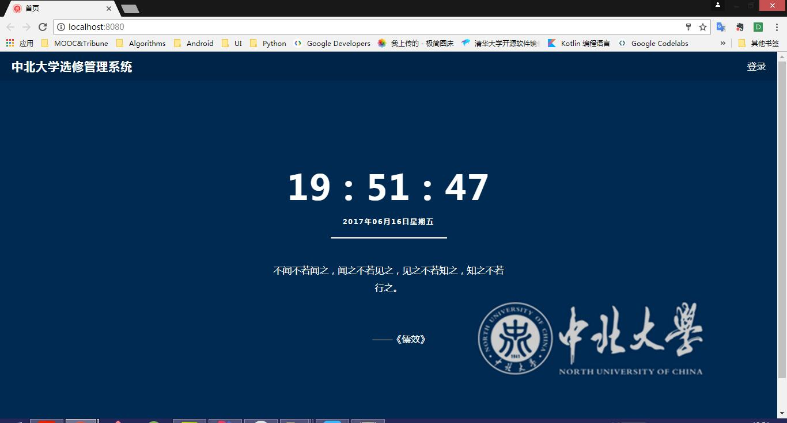
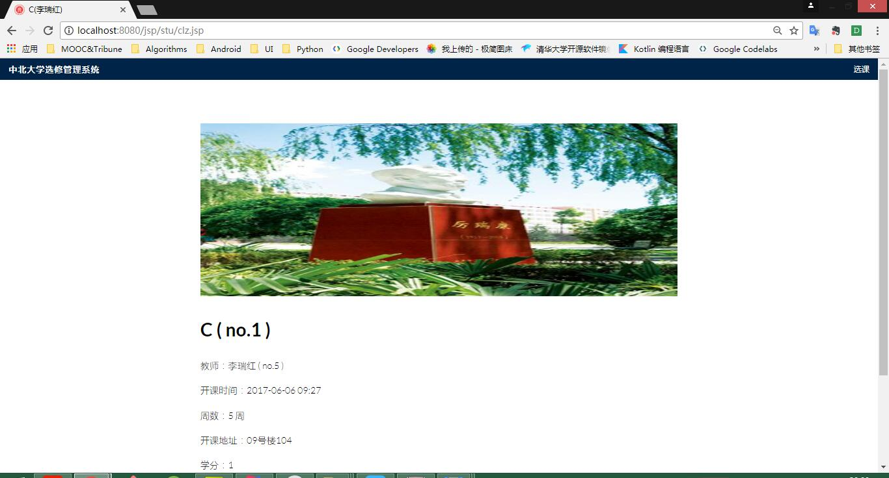
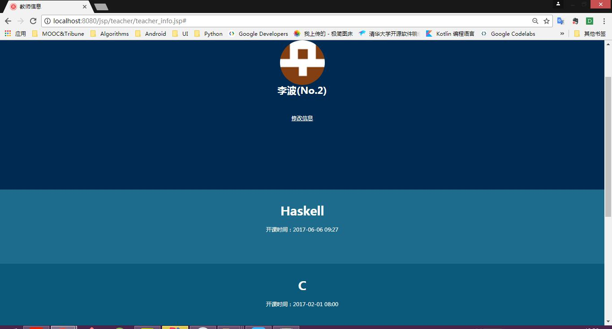
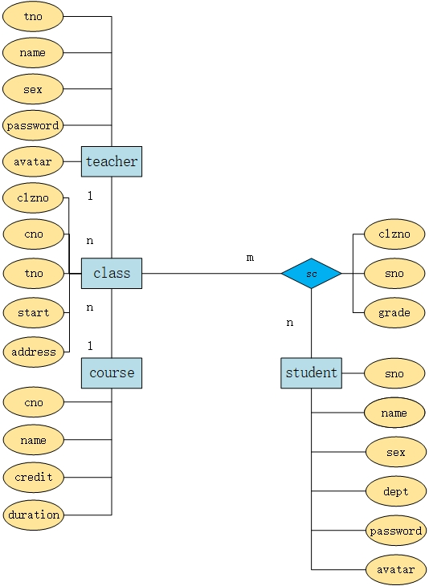

# ElectiveManagementSystem

Elective Management System:
* entering、modify、delete teacher information、course information and student information
* convenient for students to elective course and drop course
* grade management
* query teacher information、student number、course name and so on

| Login                    | Elective                     | Teacher                         |
|:------------------------------:|:---------------------------------:|:--------------------------------:|
| |  | |

## DataBase

[database](db)

## LICENSE
[Apache License 2.0](LICENSE)